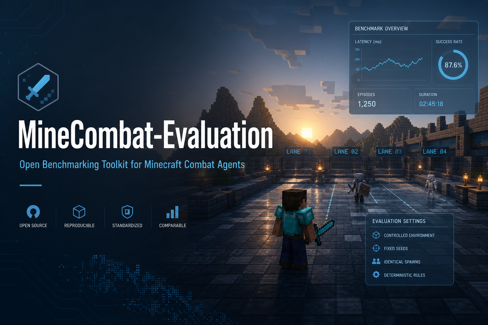

# MineCombat-Evaluation

<p align="center">
  
</p>

Paper plugin + TCP JSON protocol for combat-survival benchmarks on Minecraft **26.1** (Paper **26.1.2**, plugin **0.1.0-SNAPSHOT**, protocol **1**).

**White paper:** [MineCombat-Evaluation: A Reproducible Minecraft Combat Benchmark for Agent Evaluation](paper/whitepaper.md)

## Quick start

```bash
cp .env.example .env          # JAVA_21, JAVA_25, SERVER
python3 -m venv .venv && source .venv/bin/activate
pip install -e .              # CLI + versioned world artifact (5.5 MB zip in package)
minecombat-eval bootstrap     # Paper + plugin + mcbench_flat-v1 + config
minecombat-eval server start  # join localhost, then:
minecombat-eval run-suite l1-v1 -o results/l1-v1-ref.jsonl
```

**Docker:** `docker compose up --build` → join `:25565` → `minecombat-eval run-suite l1-v1 --port 8765`

Full path: **[planning/run-benchmark.md](planning/run-benchmark.md)** · World artifact: **[artifacts/README.md](artifacts/README.md)**

---

## System Overview


## Benchmark Suites


| Suite | Tasks | Purpose |
|-------|------:|---------|
| `l1-v1` | 36 | Controlled mob × gear × day/night grid |
| `l2-cave-v1` | 17 | Enclosed cave combat environment |
| `l2-beach-v1` | 17 | Open beach combat environment |

---

## Releases (PyPI + GitHub)

Tagging `v*` now triggers `.github/workflows/release.yml`, which:

- builds Python wheel + sdist
- publishes `minecombat-eval` to PyPI
- creates a GitHub Release with:
  - wheel + sdist
  - world artifact zip (`mcbench_flat-v1.zip`)
  - `manifest.json`
  - `SHA256SUMS.txt`

### One-time repository setup

1. Configure trusted publishing for PyPI project `minecombat-eval` (recommended), or set `PYPI_API_TOKEN` if you prefer token mode.
2. Ensure the GitHub Actions environment named `pypi` exists and is allowed for release workflow.

---

## Brand Assets

- Prompt pack for polished banners/icon: `assets/branding-prompts.md`
- Generated hero banner: `assets/minecombat-banner-hero.png`
- Generated technical banner: `assets/minecombat-banner-tech.png`
- Generated icon: `assets/minecombat-icon.png`

---

## Scripts

From repo root (loads **`.env`**):

| Script | Purpose |
|--------|---------|
| `./scripts/run-gradle.sh` … | Build plugin (JDK **21**) |
| `./scripts/run-paper.sh` | Start Paper (JDK **25**) |
| `./scripts/sync-config.sh` | Copy repo `config.yml` → server (**restart Paper** after) |
| `python3 scripts/summarize_results.py` | JSONL → tables / CSV |

JAR output: `paper-plugin/build/libs/minecombat-evaluation-0.1.0-SNAPSHOT.jar`

## `.env` example

```bash
JAVA_21=/path/to/temurin-21/Contents/Home
JAVA_25=/path/to/temurin-25/Contents/Home
SERVER=$HOME/minecraft-paper-mcbench
```

World: **`mcbench_flat`** (`level-name` in `server.properties`). L2 arenas are not generated from config — see **`planning/world-setup.md`**.

## Python eval

Requires Paper + plugin + **one player online**. Stdlib only (Python 3.10+).

```bash
python3 run_eval.py --scenario ZombieRoom-v0 --episodes 3 --seed-base 0
python3 run_suite.py --suite benchmarks/l1-v1/suite.json -o results/l1-v1.jsonl
```

Flags and scenario ids: **`planning/commands-and-scenarios.md`**. Custom policies: **`planning/agent-integration.md`**.

Official baseline: **`ReferenceCombatPolicy`** (`minecombat_eval/reference_policy.py`).

## Porting your own policy

Full guide: **[docs/policy-porting.md](docs/policy-porting.md)**. The fast path:

```bash
minecombat-eval init-policy my_agent --kind conditional        # scaffold an editable package
minecombat-eval test-policy my_agent.policy:MyAgentPolicy       # validate offline (no Minecraft)
minecombat-eval run-suite l1-v1 --policy my_agent.policy:MyAgentPolicy -o results/l1.jsonl
```

`init-policy` supports `--kind scripted|conditional|torch`. `test-policy` runs
your `act()` on synthetic observations and checks every `Action`, catching import
errors, exceptions, and bad outputs before you start a server. Helpers
(`nearest_mob`, `aim_at`, …) and runnable examples live in
`minecombat_eval.helpers` and **[examples/custom_policy/](examples/custom_policy/)**.

Eval logs (`episodes.jsonl`, `results/`) are gitignored.
