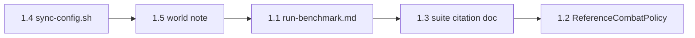

# Research-ready plan (post MVP 1.0)

Goal: external researchers can **reproduce a cited benchmark run** in one session without debugging config drift, missing world geometry, or undocumented suite ids.

**Not in scope:** perfect RL integration, parallel envs, or reward shaping. **In scope:** clear docs, baselines, official suites, sync tooling, and paper-friendly aggregation.

---

## Current state (MVP 1.0 shipped in repo)

| Area | Status |
|------|--------|
| Protocol v1 + TCP eval | Done (`planning/protocol-v1.md`, `run_eval.py`) |
| L1 scenarios + task_spec grid | Done (`ZombieRoom-*`, `benchmarks/l1-v1/` — 36 tasks) |
| L2 cave + beach environments | Done (`CaveRoom-*`, `BeachRoom-*`, 17 each) |
| Suite runner | Done (`run_suite.py`, terminal summary) |
| Policies | `NoopPolicy` only; stubs `noop` / `random` |
| Config sync | Manual merge; Paper does not overwrite live `config.yml` |
| World | Custom cave/beach built into `mcbench_flat`; not shipped in repo |
| Pinned versions | `paper-plugin/gradle.properties`: MC **26.1**, Paper API **26.1.2** |
| Eval outputs | Gitignored (`episodes.jsonl`, `results/`) |

---

## Definition of “research ready” (Tier 1 complete)

A new researcher can, from README + one doc, within ~30 minutes:

1. Build the plugin JAR with documented JDK versions.
2. Start Paper, sync config, join the **correct** world.
3. Run **`l1-v1`**, **`l2-cave-v1`**, or **`l2-beach-v1`** with `--episodes 10 --seed-base 0`.
4. Get JSONL logs and cite suite id + version + seed protocol in a paper.
5. Compare against **`ReferenceCombatPolicy`** (not only noop/random).

---

## Tier 1 — before asking others to run evals

### 1.1 One-page “run the benchmark” doc

**Deliverable:** `planning/run-benchmark.md` (single path; README links to it prominently).

**Sections (in order):**

1. **Prerequisites** — Python 3.10+, JDK **21** (Gradle), JDK **25** (Paper 26.1), Minecraft Java client matching server, `.env` template (`JAVA_21`, `JAVA_25`, `SERVER`).
2. **Pin versions** — table: MC 26.1, Paper build (exact build from your working server, e.g. `26.1.2`), plugin `0.1.0-SNAPSHOT`, protocol `1`, suite versions `l1-v1` / `l2-cave-v1` / `l2-beach-v1` v1.
3. **Build** — `./scripts/run-gradle.sh jar` → JAR path.
4. **Server setup** — copy JAR to `$SERVER/plugins/`, `level-name=mcbench_flat`, EULA, first start.
5. **Sync config** — `./scripts/sync-config.sh` (see 1.4).
6. **Start + join** — `./scripts/run-paper.sh`, client → `localhost`.
7. **Smoke test** — one `nc` reset + one `run_eval.py --scenario ZombieRoom-v0`.
8. **Full benchmark** — three official commands (see 1.3).
9. **Troubleshooting** — unsupported scenario_id (stale config), player offline, can't move during eval (TCP agent), mobs everywhere (isolation block missing).

**Acceptance criteria:**

- [ ] No step requires reading Java or Python source.
- [ ] README “Quick start” is ≤5 lines + link to this doc.
- [ ] Doc mentions **restart Paper** after config/JAR changes.

**Files to touch:** `README.md`, new `planning/run-benchmark.md`, optional `scripts/scripts.md` one-liner.

**Effort:** ~2–3 hours.

---

### 1.2 Reference baseline agent (`ReferenceCombatPolicy`)

**Deliverable:** `minecombat_eval/reference_policy.py` — `ReferenceCombatPolicy` class; documented in `planning/agent-integration.md`.

**Behavior (minimal heuristic, no ML):**

| Step | Logic |
|------|--------|
| Target | Nearest hostile in `observation.mobs` (lowest `distance`). |
| Aim | Set `yaw_delta` / `pitch_delta` toward target each tick (clamp ±15° / ±8°). |
| Move | `forward=1` if distance > 3.0; `strafe` ±0.5 simple orbit if distance < 2.5; `sprint` if distance > 6. |
| Attack | `attack=true` if distance ≤ 3.2 and roughly facing target (optional: always attack in range). |
| Jump | `jump` if `on_ground` and distance < 2.0 (optional). |
| Fallback | No mobs → noop. |

**CLI:**

```bash
python3 run_eval.py --policy minecombat_eval.reference_policy:ReferenceCombatPolicy ...
python3 run_suite.py ... --policy minecombat_eval.reference_policy:ReferenceCombatPolicy
```

**Acceptance criteria:**

- [ ] Beats `noop` and usually beats `random` on `ZombieRoom-v0` over 5 seeds.
- [ ] No extra dependencies; ≤80 lines in policy class.
- [ ] Listed in run-benchmark doc as **official baseline**.

**Effort:** ~3–4 hours (implement + quick manual eval).

---

### 1.3 Official suite IDs to cite

**Deliverable:** `planning/benchmark-suites.md` (or section in `run-benchmark.md`).

**Canonical suites:**

| Suite ID | Version | Tasks | Base | Citation string example |
|----------|---------|-------|------|-------------------------|
| `l1-v1` | `1` | 36 | `ZombieRoom-v0` + task_spec | MineCombat-Eval L1-v1 |
| `l2-cave-v1` | `1` | 17 | `CaveRoom-v0*` | MineCombat-Eval L2-cave-v1 |
| `l2-beach-v1` | `1` | 17 | `BeachRoom-v0*` | MineCombat-Eval L2-beach-v1 |

**Recommended reporting protocol:**

```text
Seeds: episode i uses seed = seed_base + i (default seed_base=0).
Episodes per task: 10 (report mean ± std or CI offline).
Agent: name + commit hash; include ReferenceCombatPolicy as baseline.
Logs: results/<suite>-seed0-ep10.jsonl; fields: suite_id, task_id, outcome, ticks, seed.
```

**Official commands:**

```bash
mkdir -p results
python3 run_suite.py --suite benchmarks/l1-v1/suite.json \
  --episodes 10 --seed-base 0 \
  --policy minecombat_eval.reference_policy:ReferenceCombatPolicy \
  -o results/l1-v1-ref.jsonl

python3 run_suite.py --suite benchmarks/l2-cave-v1/suite.json \
  --episodes 10 --seed-base 0 \
  --policy minecombat_eval.reference_policy:ReferenceCombatPolicy \
  -o results/l2-cave-v1-ref.jsonl

python3 run_suite.py --suite benchmarks/l2-beach-v1/suite.json \
  --episodes 10 --seed-base 0 \
  --policy minecombat_eval.reference_policy:ReferenceCombatPolicy \
  -o results/l2-beach-v1-ref.jsonl
```

**Acceptance criteria:**

- [ ] Each suite.json `suite_id` / `suite_version` matches doc.
- [ ] Paper template paragraph copy-paste ready.
- [ ] `run_suite.py` JSONL rows include `suite_id`, `task_id`, `seed`, `outcome`, `ticks`.

**Effort:** ~1 hour (docs only).

---

### 1.4 `scripts/sync-config.sh`

**Deliverable:** `scripts/sync-config.sh` — copies repo template config to live server.

**Behavior:**

```bash
# Pseudocode
SRC=paper-plugin/src/main/resources/config.yml
DST=$SERVER/plugins/MineCombat-Evaluation/config.yml
# Require SERVER from .env or arg
# Optional: backup DST to DST.bak.<timestamp>
# cp SRC DST
# Remind: restart Paper
```

**Flags (optional):**

- `--dry-run` — print paths only.
- `--no-backup` — skip backup.

**Acceptance criteria:**

- [ ] Documented in `run-benchmark.md` step 5.
- [ ] Fails clearly if `SERVER` unset or dest dir missing.
- [ ] Does **not** copy JAR (config only); separate from deploy.

**Effort:** ~30 minutes.

---

### 1.5 World / environment note

**Deliverable:** `planning/world-setup.md` (or section in `run-benchmark.md` + `benchmarks/l2-v0/README.md`).

**Must state clearly:**

1. Eval world name: **`mcbench_flat`** (`evaluation.world` = `server.properties` `level-name`).
2. **Level 1** uses template spawns at **y = -60** (flat/superflat region); blank superflat at wrong Y will fail silently (void / wrong floor).
3. **Level 2 cave** and **beach** are **fixed coordinates** in the same world (`planning/ground_truths/positions.md`); arenas must exist at those coords (pre-built map).
4. Repo does **not** ship the world folder — options for researchers:
   - **A (lab):** Download/copy your built `mcbench_flat` region (document hash/size when available).
   - **B (dev):** Build arenas manually at listed coords (minimal for L1 only).
5. Isolation defaults: no natural spawn, world border, no mob griefing.

**Acceptance criteria:**

- [ ] Researcher understands L2 will not work on a fresh superflat with no cave/beach builds.
- [ ] Coordinates match `config.yml` and `ground_truths/positions.md`.

**Effort:** ~1–2 hours (prose + optional world export checklist).

**Future (Tier 3+):** Ship a minimal schematic or region file; second `level-name` per environment.

---

### Tier 1 implementation order



| Order | Item | Blocker for |
|-------|------|-------------|
| 1 | sync-config.sh | Reliable config for all other steps |
| 2 | world-setup note | Honest expectations before external users |
| 3 | run-benchmark.md | Single entrypoint |
| 4 | benchmark-suites.md | Citable eval protocol |
| 5 | ReferenceCombatPolicy | Meaningful baseline numbers |

**Tier 1 total estimate:** ~1–2 dev days.

---

## Tier 2 — fair comparisons and paper tables

### 2.1 Offline results summary

**Deliverable:** `scripts/summarize_results.py` (or `minecombat_eval/summarize.py` + thin CLI).

**Input:** One or more JSONL files (`results/*.jsonl`).

**Output:**

- Terminal table (markdown-friendly).
- Optional `--csv results/summary.csv`.
- Per `task_id` (or `scenario_id` if no task_id): episodes, success_rate, failure_rate, timeout_rate, mean_ticks, std_ticks.
- Overall row per file; optional group by `suite_id`.

**Example:**

```bash
python3 scripts/summarize_results.py results/l1-v1-ref.jsonl
python3 scripts/summarize_results.py results/*.jsonl --csv results/combined.csv
```

**Acceptance criteria:**

- [ ] Stdlib only; handles empty/missing outcome gracefully.
- [ ] Documented in `benchmark-suites.md` as post-run step.

**Effort:** ~2–3 hours.

---

### 2.2 Observation schema doc

**Deliverable:** `planning/observation-v1.md`.

**Contents:**

1. Version stamp (`observation v1`, tied to protocol 1).
2. Top-level keys: `tick`, `player`, `mobs`, `meta` — required vs optional.
3. Field types and ranges (`forward` not in obs; actions separate).
4. **`meta` stability contract** — which keys are guaranteed for benchmark comparability.
5. L2 extensions: `environment_id`, `hostile_count`, `task_spec_applied`.
6. Example minimal obs + multi-mob obs.
7. Note: no pixels/inventory in v1; unknown fields ignored.
8. Fix stale line in `protocol-v1.md` (L2 now implemented).

**Acceptance criteria:**

- [ ] LLM agent author can implement a parser without reading Java.
- [ ] Linked from `agent-integration.md`.

**Effort:** ~2 hours.

---

### 2.3 Benchmark cards (short)

**Deliverable:** `planning/benchmark-cards.md`.

**One card per environment / suite family:**

| Card | Contents |
|------|----------|
| **L1 template arena** | Skill target (melee baseline), spawn, gear grid, success = all hostiles dead, timeout 2400 ticks |
| **L1-v1 grid** | 6×3×2 task_spec combos; cite as L1-v1 |
| **L2 cave** | Underground, low light, explosion pressure mobs; coords; 17 scenarios |
| **L2 beach** | Surface, ranged/kiting; coords; 17 scenarios |

Each card: **~1 paragraph + bullet table** (success, fail, timeout, max_ticks, mob count default).

**Acceptance criteria:**

- [ ] Paper “Benchmark” section can quote cards directly.
- [ ] Cross-links to `ground_truths/positions.md`.

**Effort:** ~2 hours.

---

### Tier 2 implementation order

1. observation-v1.md (unblocks agent authors)
2. benchmark-cards.md (unblocks paper writing)
3. summarize_results.py (unblocks result tables)

**Tier 2 total estimate:** ~1 dev day.

---

## Tier 3 — later (not blocking MVP 1.0)

| Item | Why defer | Rough approach when needed |
|------|-----------|----------------------------|
| Config reload without restart | Ops convenience | `/mceval reload` or Paper `reloadConfig()` + `engine.reloadSettings()` |
| Human / keyboard baseline | Different control mode | Passthrough flag on episode or separate “human policy” |
| Reward shaping in protocol | Benchmark uses terminal outcome | Sparse terminal in plugin; optional `--reward-mode` in Python |
| Parallel envs | Serial is fine for v1 | N servers, N ports, suite shard by task range |
| pip package | Install friction vs git clone | `pyproject.toml`, package `minecombat_eval` |
| Rich observations | LLM can start with JSON state | Protocol v2; versioned obs encoder |
| Ship world / schematics | Large artifact | Region file + SHA256 in world-setup.md |
| Plugin `/mceval` commands | TCP-only is OK for researchers | Optional CLI for reset/status |

---

## File map (what to create)

| Path | Tier | Purpose |
|------|------|---------|
| `planning/run-benchmark.md` | 1 | One-page run path |
| `planning/benchmark-suites.md` | 1 | Citable suite ids + seed protocol |
| `planning/world-setup.md` | 1 | World / L2 geometry requirements |
| `scripts/sync-config.sh` | 1 | Config deploy |
| `minecombat_eval/reference_policy.py` | 1 | `ReferenceCombatPolicy` |
| `planning/observation-v1.md` | 2 | Obs schema for agents |
| `planning/benchmark-cards.md` | 2 | Environment blurbs |
| `scripts/summarize_results.py` | 2 | JSONL → tables/CSV |
| `README.md` | 1 | Pin versions + link run-benchmark |

**Update existing:**

- `planning/agent-integration.md` — ReferenceCombatPolicy example
- `planning/protocol-v1.md` — L2 note, link observation-v1
- `planning/tasks.md` — checkboxes for Tier 1/2
- `planning/important.md` — link this plan

---

## Risks and mitigations

| Risk | Impact | Mitigation |
|------|--------|------------|
| World not shipped | L2 (and maybe L1 Y) broken on fresh install | world-setup.md + eventual region export |
| Stale server config | `unsupported scenario_id` | sync-config.sh + run-benchmark step |
| TCP-only movement confuses users | “I can't move” | Troubleshooting in run-benchmark |
| Seed not affecting gameplay yet | Misleading “reproducibility” claims | Doc: seed logged for episode identity; gameplay RNG TBD |
| Long suite runtime | 36×10 = 360 episodes serial | Doc expected runtime; `--tasks` filter for dev |

---

## Suggested milestones

| Milestone | Includes | Tag |
|-----------|----------|-----|
| **MVP 1.0** | Current repo state | `v0.1.0` / `mvp-1.0` (now) |
| **Research preview** | Tier 1 complete | `v0.2.0-research-preview` |
| **Benchmark paper ready** | Tier 1 + Tier 2 | `v0.3.0-benchmark` |

---

## Checklist (copy to `planning/tasks.md`)

### Tier 1
- [ ] `planning/run-benchmark.md`
- [ ] `planning/benchmark-suites.md`
- [ ] `planning/world-setup.md`
- [ ] `scripts/sync-config.sh`
- [ ] `ReferenceCombatPolicy`
- [ ] README version pin + quick start link

### Tier 2
- [ ] `planning/observation-v1.md`
- [ ] `planning/benchmark-cards.md`
- [ ] `scripts/summarize_results.py`

### Tier 3 (backlog)
- [ ] Config reload
- [ ] Human baseline mode
- [ ] Reward in protocol
- [ ] Parallel envs / pip package
- [ ] Rich observations / world artifact
